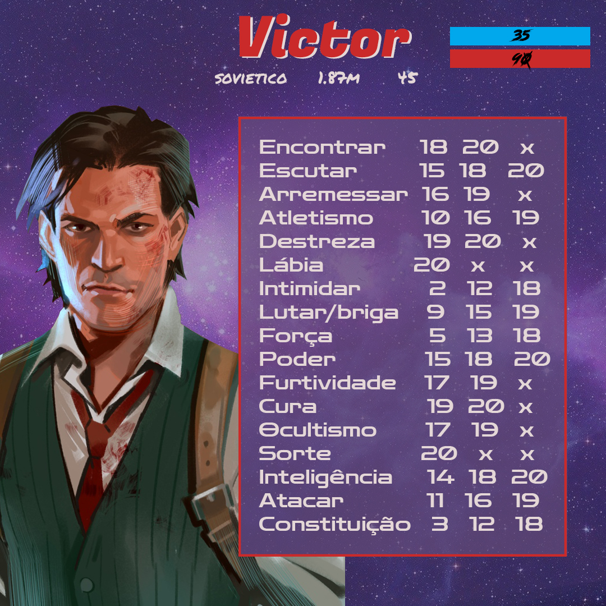
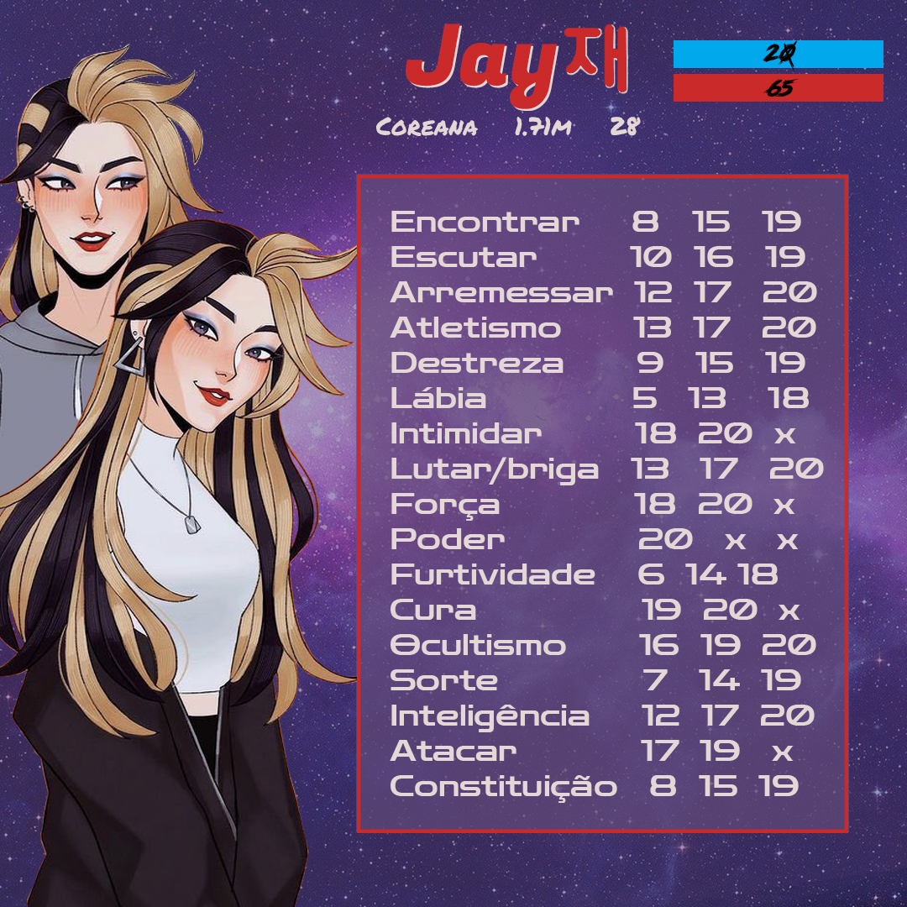
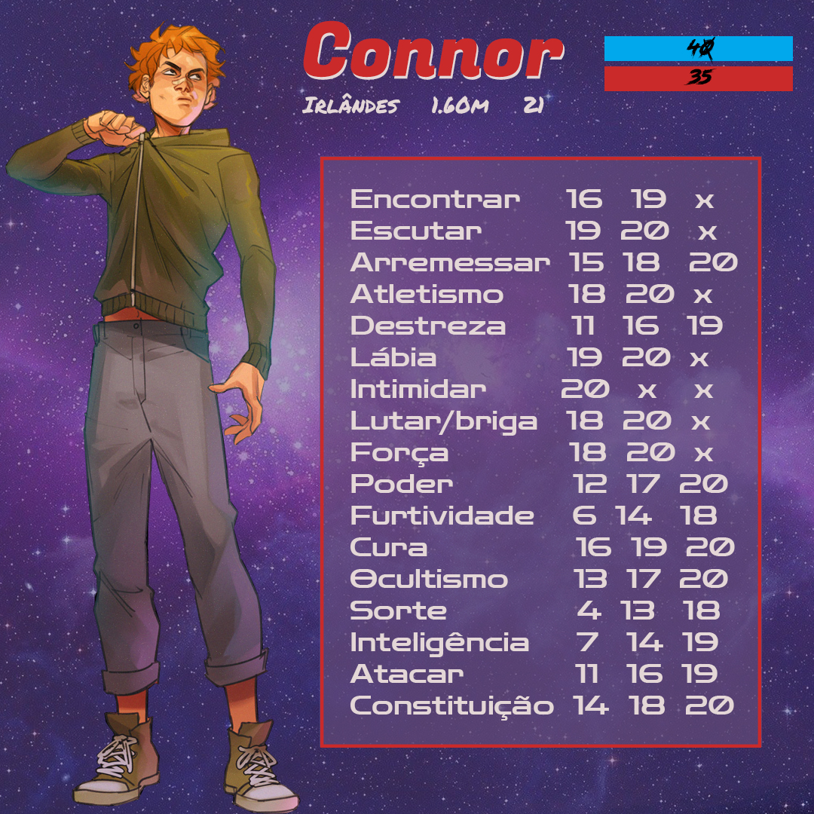
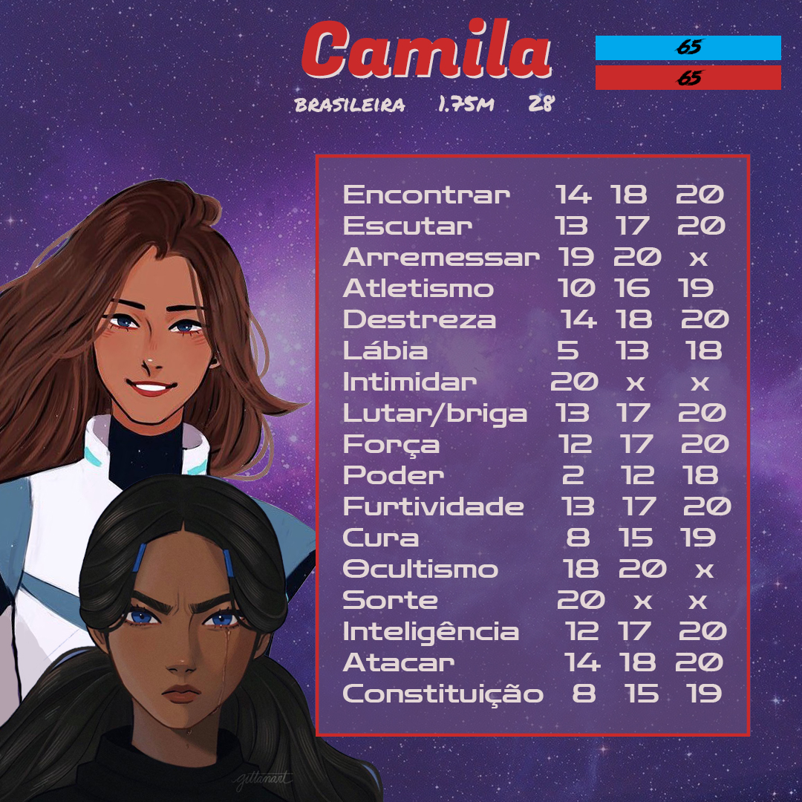
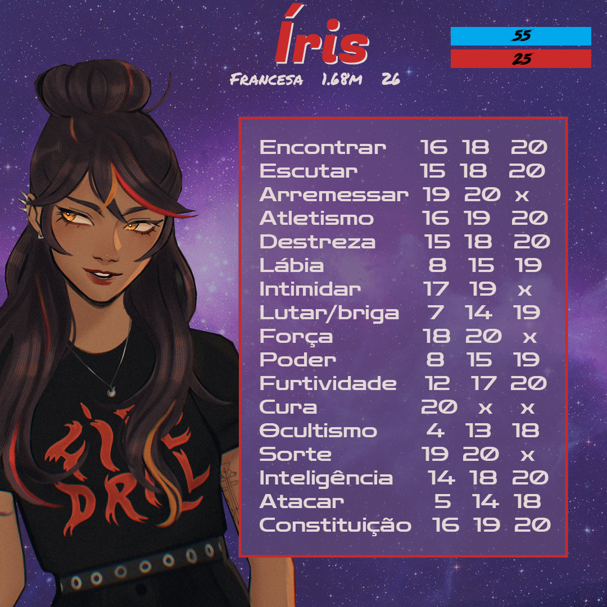
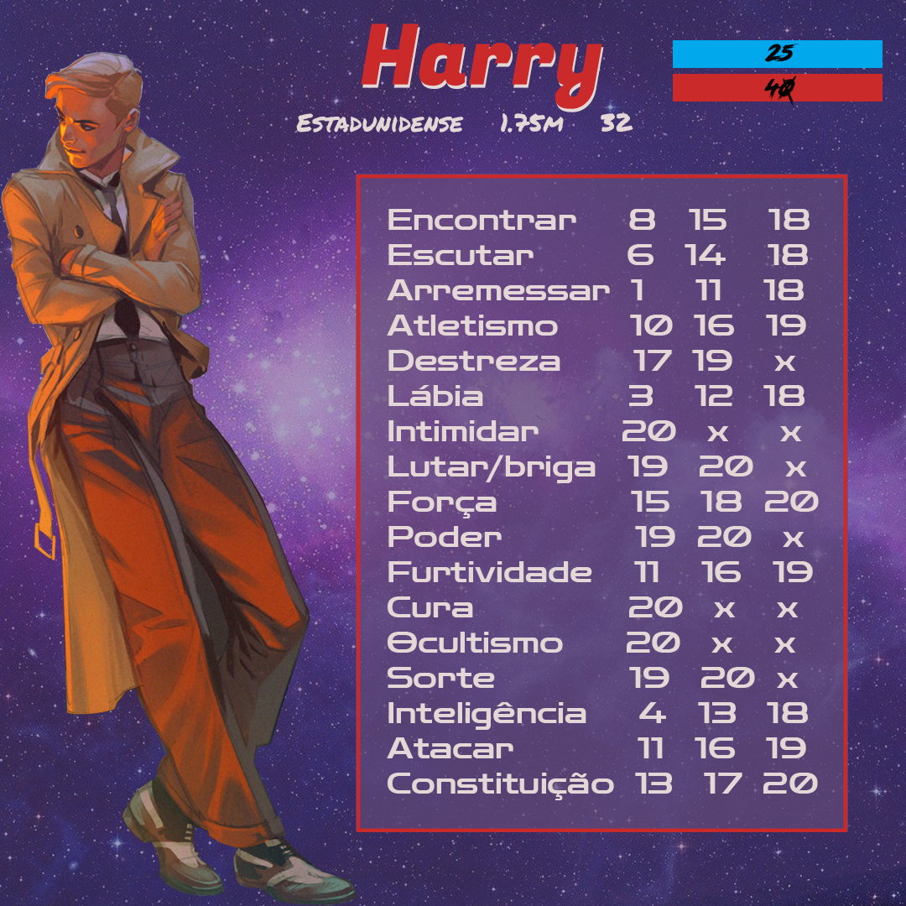

# Divisão de personagens

---

## Tabela de jogadores

| Personagem | Jogador   |
| ---------- | --------- |
| Harry      | Silvestre |
| Camila     | Will      |
| Jay        | Dom       |
| Íris       | Almeida   |
| Victor     | Heitor    |
| Connor     | Ormo      |

---

## Descrição dos jogadores

## Victor

* Foi agente da KGB
* Entrou na KGB como agente de campo, mas eventualmente foi transferido para a diretoria de Eso-operações
* Suas primeiras missões resultaram em desastre, que lhe deixou com um sério trauma do paranormal
* Atualmente trabalha para a KGB em investigações e obtendo informações, em Londres.
* Odeia palhaços
* Apaixonado por homens bonitos
* Muito supersticioso.
> Suas superstições levam a sorte dele a agir da forma que ele espera que agiriam. Ver um gato preto, passar por baixo de uma escada ou assoviar dentro de casa resultam em diminuição do atributo de sorte. No entanto, amuletos de sorte tem o dobro do efeito nele, assim como superstições de boa sorte. 

**Arma:** Espingarda serrada calibre 12 de ação basculante (break action), barril duplo. 
*Também tem um facão, mas você não vai querer descobrir isso.*
**Nacionalidade:** Tankie
**Idade:** 45
**Altura:** 1,87
**Signo:** Câncer
**Temperamento:** Colérico

## Jay

* E-girl
* Sério problema com energéticos
* Psicológico terrivelmente instável
* Pais criminosos, cresceu aprendendo a ouvir o que não devia sem que percebessem.
* Formada em química, especializada no uso de venenos. 
* Gosta muito de explosivos
* Odeia barulho

**Arma:** Kit de explosivos e uma adaga decorada com o brasão da família
**Nacionalidade:** Coreana
**Idade:** 28
**Altura:** 1,71
**Signo:** Gêmeos
**Temperamento:** Fleumático

> Rituais

| Número | Nome                | Ingredientes                  |
| :----: | ------------------- | ----------------------------- |
| **2**  | Ódio incontrolável  | Próprio sangue sobre seu olho |
| **8**  | Detectar paranormal | Fonte de energia              |

## Connor

* Nerd esquisito e irritante
* Filho de enfermeira
* Perdeu o pai pra um zumbi de sangue ainda novo
* Obsessão por arcades
* Obsessão por bebidas alcóolicas
* Fumante
* Fã de Madonna
* Odeia mulheres

**Arma:** Revólver .38, clipe de 6 cartuchos. Leva sempre um caniteve e um isqueiro. 
**Nacionalidade:** Irlandês
**Idade:** 21
**Altura:** 1,60
**Signo:** Aquário 
**Temperamento:** Fleumático-melancólico

> Rituais

| Número | Nome                      | Ingredientes   |
| :----: | ------------------------- | -------------- |
| **5**  | Envelhecimento localizado | Cinzas humanas |

## Camila

* Líder
* Péssima líder (tentando aprender a ser)
* Psicológico estável
* Habilidades de comunicação decentes
* Só tem o pai
* Participou de uma missão horrível na Ordem, que a mudou completamente como pessoa. (O jogador escolhe qual foi a missão | qualquer coisa fala que foi um SB)
* Se arrepende de muita coisa, mas não deixa isso transparecer
* Medo de machucar quem ela ama
* Gosta de ficar abraçando pessoas e fazendo high-five toda hora

**Arma:** Glock com clipe de 19 cartuchos. Leva sempre uma faca.
**Nacionalidade:** Brasileira :face_vomiting:
**Idade:** 28
**Altura:** 1,75
**Signo:** Áries
**Temperamento:** Melancólico-Colérico

## Íris

* Órfã, seus pais sumiram quando tinha 7 anos
* Desde então, vive sozinha nas ruas da França, quando aprendeu a usar o paranormal para garantir sua sobrevivência. 
* Tem um colar com um pingente da sua mãe. O amuleto dá sorte ao usuário. 
* Se aproximou do paranormal por causa do amuleto.
* Faz parte de uma banda chamada *Fire Drill*
* Sabe cantar e tocar guitarra
* Punk
* Obcecada por sangue
* Odeia pessoas felizes
* Odeia algodão-doce

**Arma:** Um cutelo de cozinha. Que sadismo.
**Nacionalidade:** Francesa
**Idade:** 26
**Altura:** 1,68
**Signo:** Escorpião
**Temperamento:** Melancólico

> **Rituais**

| Número | Nome                         | Ingredientes     |
| :----: | ---------------------------- | ---------------- |
| **1**  | Gritos                       | Arame farpado    |
| **3**  | Eletrocutação                | Fonte de energia |
| **4**  | Dissolver criatura de sangue | Corrente         |
| **7**  | Dilaceração                  | Próprio sangue   |

## Harry estilos

* Trabalha como detetive policial 
* Trabalhou em um circo por um tempo, mas sofreu um acidente
* É inseguro e tem medo de tomar iniciativas
* Muito bom em convencer pessoas
* Teve sua irmã mais nova sequestrada aos 16 anos
* Tem pavor de alturas e fogo (não se aplica a armas)
* Viciado em café

**Arma:** Revólver Colt .357, barril de 6 cartuchos. 
**Nacionalidade:** Yankee
**Idade:** 32
**Altura:** 1,75
**Signo:** Peixes
**Temperamento:** Sanguíneo

---

## Rituais

| Número | Nome                         |          Elemento          | Descrição                                                                                                                                                                                                                                                                             |
| :----: | ---------------------------- | :------------------------: | ------------------------------------------------------------------------------------------------------------------------------------------------------------------------------------------------------------------------------------------------------------------------------------- |
| **1**  | Gritos                       |          *Sangue*          | O afetado ouve gritos incessantes, inibindo e atrapalhando suas ações e racionalidade.                                                                                                                                                                                                |
| **2**  | Ódio incontrolável           |          *Sangue*          | O afetado sente um ódio incontrolável, aumentando consideravelmente suas habilidades físicas e impedindo seu pensamento racional por toda a duração do ritual.                                                                                                                        |
| **3**  | Eletrocutação                |         *Energia*          | Raios saem do corpo do usuário, vindos de uma fonte de energia, eletrocutando o alvo escolhido.                                                                                                                                                                                       |
| **4**  | Dissolver criatura de sangue |          *Sangue*          | Afeta criaturas de sangue alterando o psicógico do usuário, te permitindo combater diretamente as emoções da criatura.                                                                                                                                                                |
| **5**  | Envelhecimento localizado    |          *Morte*           | O tempo é afetado na área de uma ferida, que cicatriza em velocidade muito maior, curando a ferida local. Piora infecções.                                                                                                                                                            |
| **6**  | Decadência                   |          *Morte*           | Usando cinzas animais e um órgão humano, é possível infectar um alvo com uma doença ou piorar uma pré-existente, causando sério dano físico no alvo durante a cena.                                                                                                                   |
| **7**  | Dilaceração                  |          *Sangue*          | Ao passar seu próprio sangue em uma arma branca, é possível aplicar uma maldição temporária na arma que a faz inflingir dano de sangue extra.                                                                                                                                         |
| **8**  | Detectar paranormal          | *Energia* e *conhecimento* | Com o uso de uma fonte de energia, o ritual permite ao usuário ver a localização de concentrações de atividade paranormal em seu campo de visão                                                                                                                                       |
| **9**  | Repetição de dano            |          *Morte*           | O usuário cria uma cópia do inimigo entre suas mãos. Quando maior o dano que o inimigo sofrer após a criação da cópia, mais parecia essa será com o alvo. O usuário pode a qualquer momento estourar a cópia, fazendo com que todos os golpes sofridos até o momento sejam repetidos. |